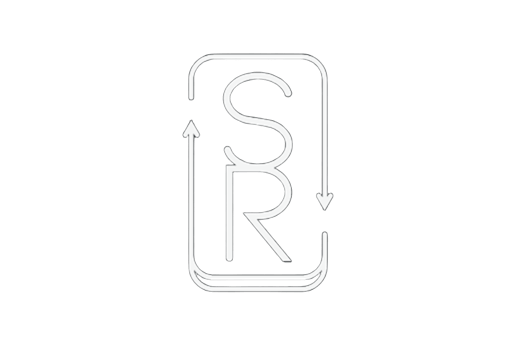
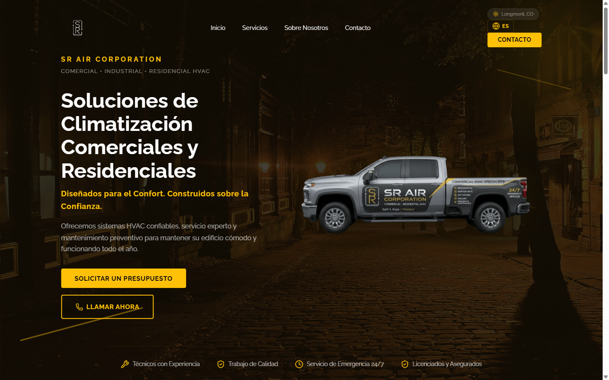
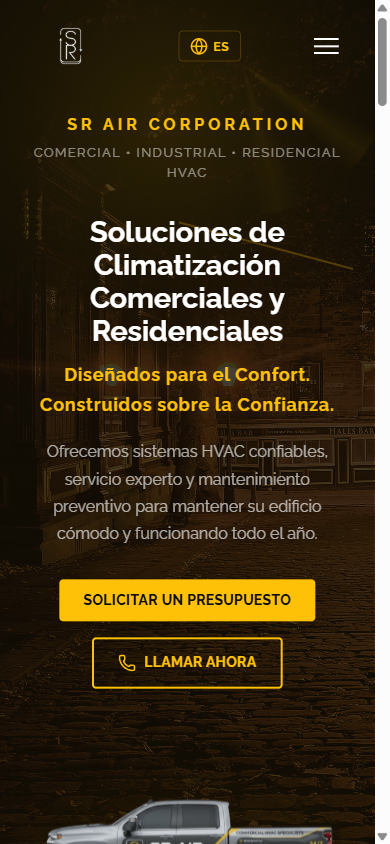
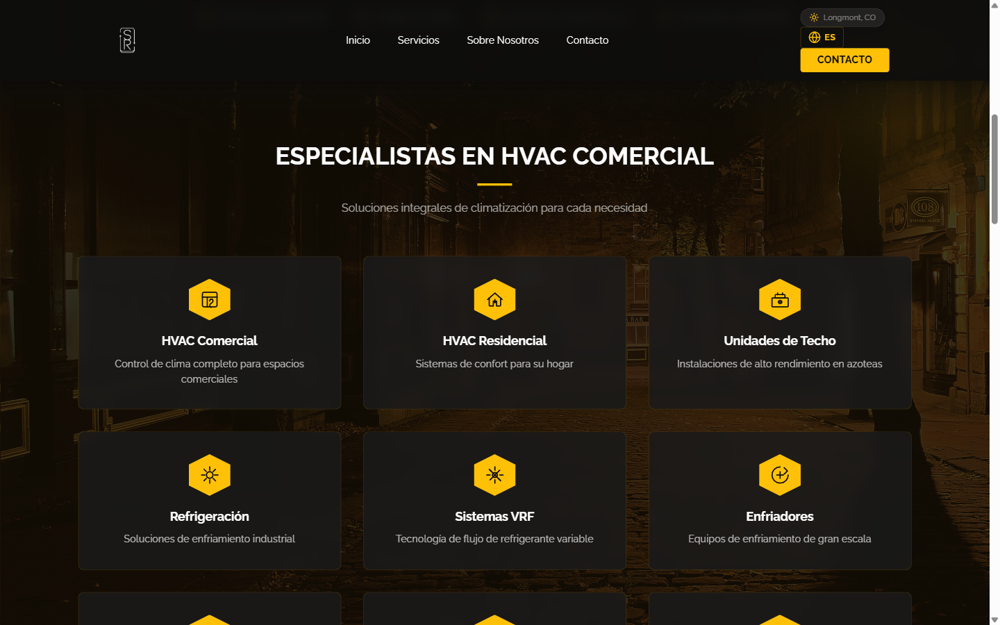
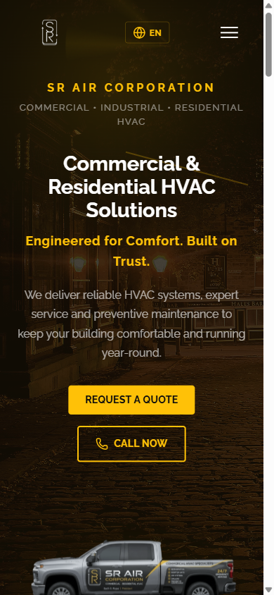

<div align="center">
  
  <br/><br/>
  <h1>SR AIR CORPORATION</h1>
  <p><strong>Commercial • Industrial • Residential HVAC</strong></p>
  <p>Professional landing page for a Colorado-based HVAC contracting company.</p>

  <p>
    
    
    
    
  </p>
</div>

---

## ✨ Features

- **🌐 Bilingual EN/ES** — Full internationalization with `react-i18next`. Detects browser language on first visit, defaults to English. Toggle with the globe icon in the navbar.
- **🌦️ Live Weather Integration** — Displays current weather in Longmont, CO via OpenWeatherMap API with dynamic visual effects (rain, snow, clouds).
- **📱 Fully Responsive** — Mobile-first design with adaptive navigation, collapsing menus, and optimized layouts for every screen size.
- **🎨 Premium Design** — Dark theme with gold accents (`#ffc107`), Raleway typography, parallax scroll effects, and smooth reveal animations.
- **📸 QR Code** — Dynamic QR code generation for quick access to `sraircorp.com`.
- **⚡ Performance** — Built with Vite for instant HMR and optimized production builds.

## 🖼️ Screenshots

| Desktop | Mobile |
|---|---|
|  |  |
| Desktop hero with CTA and weather badge | Mobile layout with hamburger menu |
|  |  |
| Services grid with 9 HVAC categories | Spanish language mode after toggle |

## 🛠️ Tech Stack

| Technology | Purpose |
|---|---|
| **React 19** | UI framework |
| **Vite 8** | Build tool and dev server |
| **react-i18next** | Internationalization (EN/ES) |
| **Lucide React** | Icon library |
| **qrcode.react** | QR code generation |
| **CSS3** | Custom styles with CSS custom properties |
| **OpenWeatherMap API** | Live weather data |

## 🚀 Getting Started

```bash
# Clone the repository
git clone https://github.com/brikpaul569-cmd/SR-AIR-CORPORATION.git
cd SR-AIR-CORPORATION

# Install dependencies
npm install

# Set up environment variables (optional — weather fallback works without it)
cp .env.example .env  # Add VITE_WEATHER_API_KEY for live weather

# Start the dev server
npm run dev
```

## 📜 Available Scripts

| Script | Description |
|---|---|
| `npm run dev` | Start development server with HMR |
| `npm run build` | Build for production |
| `npm run preview` | Preview production build locally |
| `npm run lint` | Run oxlint on all source files |

## 📁 Project Structure

```
SR-AIR-CORPORATION/
├── public/
│   ├── favicon.svg              # SR logo in gold
│   └── references/              # Images and logos
├── screenshots/                 # README screenshots
├── src/
│   ├── components/              # React components
│   │   ├── Navbar.jsx           # Navigation + language toggle
│   │   ├── Hero.jsx             # Hero section with CTA
│   │   ├── Services.jsx         # Service cards grid
│   │   ├── TruckShowcase.jsx    # Fleet showcase
│   │   ├── AboutUs.jsx          # About section
│   │   ├── Stats.jsx            # Animated counters
│   │   ├── ContactForm.jsx      # Modal contact form
│   │   ├── Footer.jsx           # Site footer
│   │   ├── QRCode.jsx           # QR code component
│   │   └── WeatherBadge.jsx     # Weather display
│   ├── hooks/
│   │   └── useWeather.js        # OpenWeatherMap hook
│   ├── i18n/
│   │   ├── i18n.js              # i18next configuration
│   │   └── locales/
│   │       ├── en.json          # English translations
│   │       └── es.json          # Spanish translations
│   ├── styles/                  # Global styles
│   ├── App.jsx                  # Root component
│   └── main.jsx                 # Entry point
├── index.html
├── package.json
└── vite.config.js
```

## 🌍 Internationalization

The site supports English and Spanish with full content translation:

- **First visit** — Detects browser language automatically; falls back to English
- **Persistence** — Language preference is saved to `localStorage`
- **Toggle** — Click the globe icon 🌐 in the navbar to switch between EN/ES
- **Coverage** — Every visible string, image `alt` text, and `aria-label` is translated

## 🚢 Deployment

Build the project and deploy the `dist/` folder to any static host:

```bash
npm run build
```

Supports Vercel, Netlify, Cloudflare Pages, and Surge — zero-config for SPAs.

## 📄 License

MIT © 2026 SR Air Corporation
